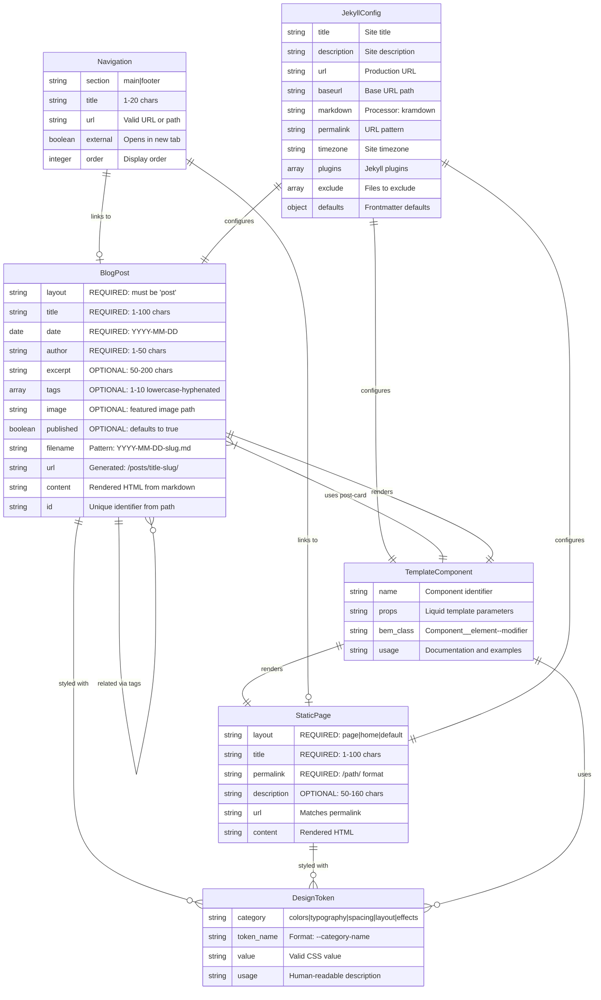
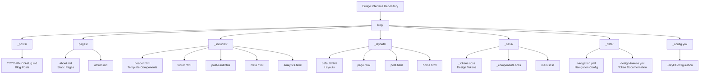
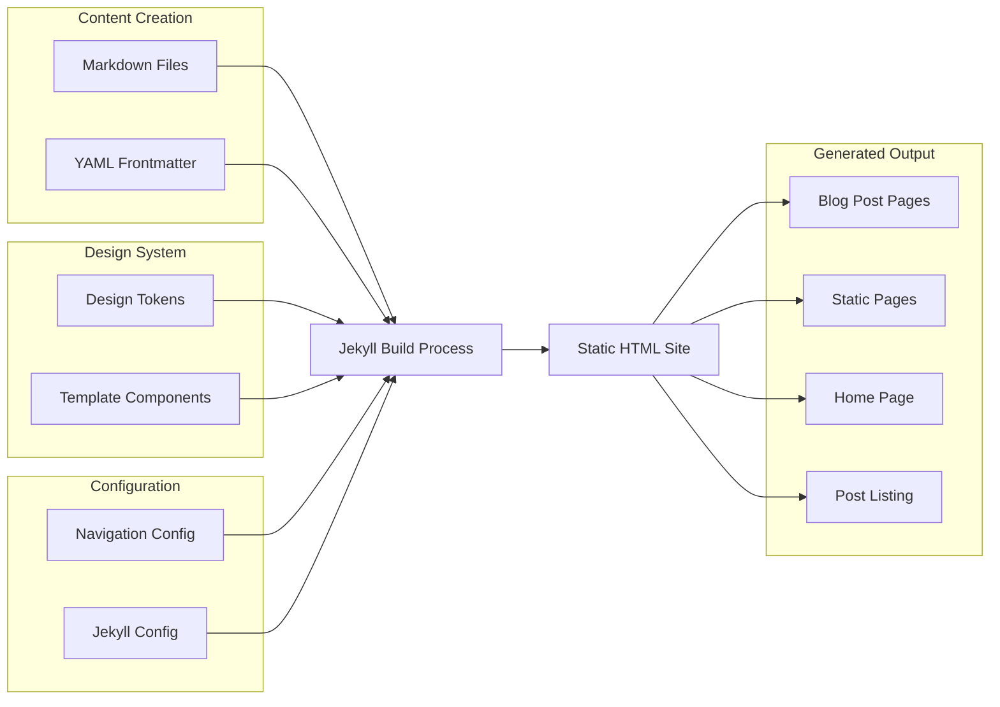
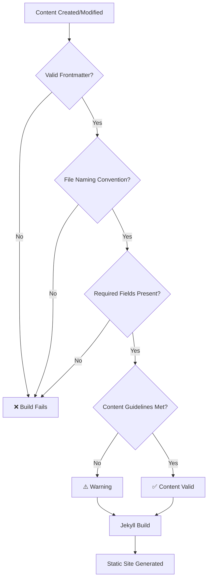
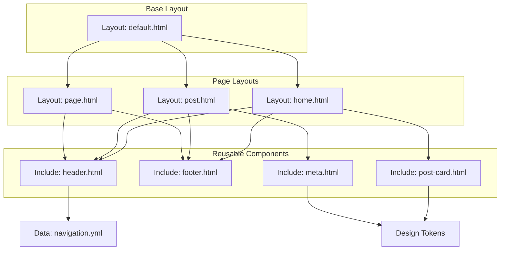

# Data Model Mermaid Diagram - Bridge Interface

This diagram represents the data model for the Phase 1 Static Jekyll Blog as defined in the specifications.

## Entity Storage Locations

## Data Flow Diagram

## Content Validation Flow

## Template Component Architecture

